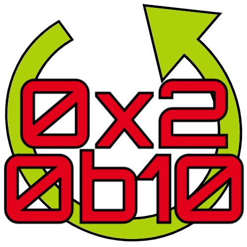

<html>
    <head>
        <meta charset="UTF-8" />
    </head>
    <body>
        

            <h1>Bitchanger Homepage</h1>
            
             
            <ul id="menu">
                <li><a href="#documentation">Documentation</a></li>
                <li><a href="#about">About</a></li>
            </ul>
        

        

        

            <h2>Documentation</h2>
            <ul id="docmenu">
                <li><a href="1.0.2/en_public/index.html">Public Doc (EN)</a></li>
                <li><a href="1.0.2/en_private/index.html">Private Doc (EN)</a></li>
                <li><a href="1.0.2/de_public/index.html">Public Doc (DE)</a></li>
                <li><a href="1.0.2/de_private/index.html">Private Doc (DE)</a></li>
            </ul>
        

        

        

            <h2>About</h2>
            

                <h3>English:</h3>
                Bitchanger is a program for converting various number systems. The main feature is the conversion of
                different number systems with decimal places. Additionally it is possible to do basic arithmetic
                operations and bitwise operations in different number systems.  Also the conversion from decimal system
                to IEEE standard (IEEE-754-2008) (32-bit or 16-bit) is possible.
                  
                All offered operations are executed via the graphical user interface, which is implemented with javaFX.
                  
                Delivery:
                  
                Delivery of the software:
                The program is packaged into a JAR file including all dependencies using the build tool Maven.
                Afterwards the command line tool jpackage (openJDK 14) is used to create an installer for Windows, macOS
                and Linux, which also contains the Java-Runtime that is required for execution.
                Due to licensing terms, only Amazon Corretto (currently version 11) and the openJDK
                (openJavaFX 11 and openJDK 14 for jpackage) are used.
                  
                Origin:
                  
                The Bitchanger was developed by Tim Mühle and Moritz Wolter for the AID laboratory (Bochum University of
                Applied Science, Germany) on behalf of Professor Brabender and Mr. Koch.
            

            

                <h3>German:</h3>
                Bitchanger ist ein Programm zum Umwandeln von diversen Zahlensystemen. Das Hauptmerkmal liegt bei der
                Umwandlung von verschiedenen Zahlensystemen mit Nachkommastellen. Zusätzlich ist es möglich in unter-
                schiedlichen Zahlensystemen die Grundrechenarten und Bitoperationen durchzuführen. Auch die Umwandlung
                von Dezimalsystem zu IEEE-Norm (IEEE-754-2008) (32-Bit oder 16-Bit) ist möglich.
                  
                Alle angebotenen Operationen werden über die graphische Benutzeroberfläche ausgeführt, die mit javaFX
                implementiert ist.
                  
                Auslieferung der Software:
                  
                Das Programm wird mit dem Buildtool Maven in eine JAR-Datei inklusive aller Abhängigkeiten gepackt.
                Im Anschluss wird mit dem Kommandozeilentool jpackage (openJDK 14) ein Installer für Windows, macOS
                und Linux zur Auslieferung bereitgestellt, der auch die zur Ausführung benötigte Java-Runtime enthält.
                Wegen Lizenzbestimmungen wird ausschließlich Amazon Corretto (aktuell Version 11) und das openJDK
                (openJavaFX 11 und openJDK 14 für jpackage) verwendet.
                  
                Entstehung:
                  
                Der Bitchanger wurde im Auftrag von Professorin Brabender und Herrn Koch von Tim Mühle und Moritz Wolter
                als Entwicklungsprojekt für das AID-Labor im Sommersemester 2020 an der Hochschule Bochum entwickelt.
            

        

    </body>
</html>
